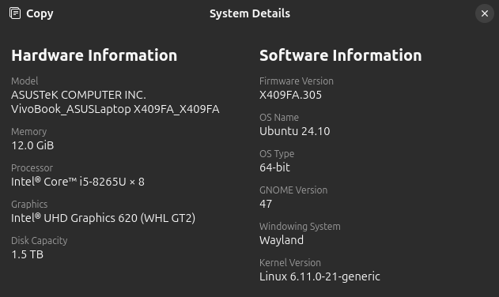

# Hi

## Env

### System details:



### SystemC 3.0.x

I'm using SystemC 3.0.x (release version). [Here](https://github.com/accellera-official/systemc/blob/release/INSTALL.md) is the place where i've cloned and installed SystemC.

**NOTE1:** I've installed SystemC at `~/systemc`. The dir-tree like:

```
. (~/systemc)
├── aclocal.m4
├── AUTHORS.md
├── autom4te.cache
├── cmake
├── CMakeLists.txt
├── config
├── configure
├── configure~
├── configure.ac
├── configure.ac~
├── CONTRIBUTING.md
├── docker
├── docs
├── examples
├── include
├── INSTALL.md
├── lib-linux64
├── LICENSE
├── Makefile.am
├── Makefile.in
├── msvc16
├── NOTICE
├── objdir
├── README.md
├── RELEASENOTES.md
├── src
└── tests
```

**NOTE2:** After install SystemC, add `~/systemc` to global variable as SYSTEMC_HOME.

```
export SYSTEMC_HOME=~/systemc
```

Anyway, U can append this into your `.profile`/`.bashrc`/`.zshrc`/...

## `init_systemc` script

After install SystemC, i make my own script for quick make Makefile to **compile** *.cpp file. `Makefile.p1` is 1st part of full Makefile, the define shebang. `Makefile.p2` is the final part of full Makefile, that define rules to complie **SRC** to **OUT**. Between `Makefile.p1` and `Makefile.p2` is `SRC` where the CPP file is. The script will ask the CPP_FILENAME to automatically complete Makefile without change SRC. But you need to check SRC again :v

**init_systemc:**

```zsh
#! /bin/zsh

export BOLD="\e[1m"
export FAINT="\e[2m"
export ITALIC="\e[3m"
export UNDERLINED="\e[4m"

export BLACK="\e[30m"
export RED="\e[31m"
export GREEN="\e[32m"
export YELLOW="\e[33m"
export BLUE="\e[34m"
export MEGENTA="\e[35m"
export CYAN="\e[36m"
export LIGHT_GRAY="\e[37m"
export NORMAL="\e[0m"
export SYSTEMC_INIT_DIR=/mnt/sda1/Linux_Applications/.my_bin/systemc_init


# printf "${BOLD}${BLUE_WHITE}1. Clone \`Makefile\` from <systemc_init/Makefile> ...\n${NORMAL}"
printf "1. Enter the *cpp filename (e.g hehe NOT hehe.cpp)\n${BOLD}CPP_FILENAME${NORMAL}="
read CPP_FILENAME

echo

if [ -z "$CPP_FILENAME" ]; then
	printf "${YELLOW}W${NORMAL}: CPP_FILENAME is ${UNDERLINED}empty${NORMAL}! \n--> use default value: CPP_FILENAME=sc_proj\n"
	CPP_FILENAME='sc_proj'
fi

echo
printf "2. Make empty $CPP_FILENAME.cpp file...\n"

if [ -e "$CPP_FILENAME.cpp" ]; then
	printf "${YELLOW}W${NORMAL}: $CPP_FILENAME.cpp ${UNDERLINED}existed${NORMAL}!\n--> Aborted!\n"
else
	touch "$CPP_FILENAME.cpp"
	printf "Done!\n"
fi

echo
printf "3. Clone Makefile into the project...\n"
CLONE_FLAG=1

if [ -e 'Makefile' ]; then
	printf "${RED}Error${NORMAL}: Makefile existed, remove the existed Makefile to continue!\n"
	CLONE_FLAG=0
	exit 1
fi

if [ $CLONE_FLAG -eq 1 ]; then  
	cat $SYSTEMC_INIT_DIR/Makefile.p1 | tee -a ./Makefile
	echo "SRC=$CPP_FILENAME.cpp" | tee -a ./Makefile
	cat $SYSTEMC_INIT_DIR/Makefile.p2 | tee -a ./Makefile
	exit 0
fi

printf "\n${BOLD}${BLUE_WHITE}DONE!${NORMAL} Check \`SRC\` in ${BOLD}Makefile${NORMAL} file and change if needed\!\n"
exit 0
```

**Makefile.p1:**

```
######################## SYSTEMC MAKEFILE ##########################
# Please change SRC (your input *.cpp file)                        #
####################################################################

#! /bin/zsh
```

**Makefile.p2:**

```

OBJ = $(SRC:.cpp=.o)
OUT = $(basename $(firstword $(SRC)))
CXX = g++
CXXFLAGS = -I. -I$(SYSTEMC_HOME)/include
LDFLAGS = -L. -L$(SYSTEMC_HOME)/lib-linux64 -Wl,-rpath=$(SYSTEMC_HOME)/lib-linux64
LDLIBS = -lsystemc -lm
all: $(OUT)

$(OUT): $(OBJ)
	$(CXX) -o $@ $^ $(LDFLAGS) $(LDLIBS)

%.o: %.cpp
	$(CXX) $(CXXFLAGS) -c $< -o $@

clean:
	rm -f $(OBJ) $(OUT)

exec:
	./$(OUT)

####################################################################
#                                                                  #
####################################################################
```

Finally, add these files into the `PATH` to make it run anywhere :))

